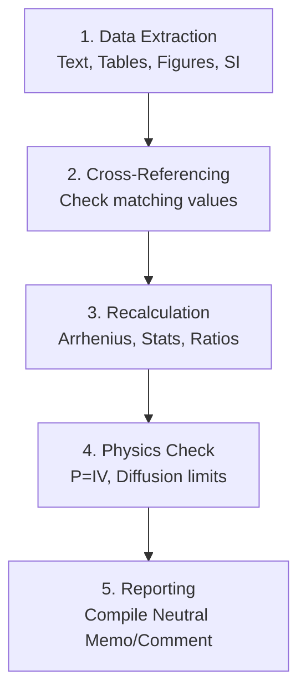

# Academic Paper Data Consistency Audit

This project provides a physics-informed technical audit workflow for published materials electrochemistry papers. It helps researchers check whether figures, tables, supplementary information, source data, recalculations, physical dimensions, and mechanistic claims are mutually consistent.

*Inspired by reproducibility and research-integrity workflows, but this project focuses on materials electrochemistry.*

---

## Motivation

In materials electrochemistry, researchers frequently build on published data to select candidate materials, construct transport models, or design device configurations (such as for fuel cells or electrolyzers). However, minor transcription errors, unit mismatches, or mathematical discrepancies in published papers can lead to wasted months of lab work when trying to reproduce results.

This project exists to provide a structured, non-confrontational technical check workflow. By focusing on data self-consistency and basic physical boundaries (such as conservation of charge and mass), we aim to help researchers verify published figures, tables, and claims before committing valuable resources to secondary studies. It also serves as a guide for authors to pre-audit their own drafts before submission, enhancing the overall reliability of the scientific record.

## Project Scope

The scope of this project is strictly limited to checking the internal self-consistency of data presented in published research (or drafts under peer review). It is designed to evaluate solid-state electrochemistry papers, particularly those describing:
*   Electrode kinetics and polarization resistance ($R_p$, $ASR$).
*   Temperature-dependent electrical conductivity ($\sigma$) and Arrhenius fittings.
*   Current-voltage-power ($I\text{--}V\text{--}P$) polarization relationships in fuel cells/electrolyzers.
*   Solid-state ionic diffusion coefficients ($D_{app}$) and electrical properties.

## What this Project Checks
*   **Data Consistency**: Discrepancies between figure points, tables, text assertions, and Supplementary Information (SI) data tables.
*   **Calculational Reproducibility**: Mathematical verification of activation energies ($E_a$), sample standard deviations, and reported performance improvement percentages.
*   **Physics-Informed Boundaries**: Conformance of data to physical constraints such as current-voltage-power relations ($P = I \times V$), charge/mass conservation, and realistic ranges for diffusion coefficients.
*   **Claim-Evidence Alignment**: Evaluation of whether qualitative conclusions or proposed electrochemical mechanisms are supported by direct evidence rather than indirect fitting or simulations alone.

## What this Project Does Not Claim
*   **No Determination of Misconduct**: This project evaluates data consistency and reproducibility. It does not judge the authors' intent or label discrepancies as academic fraud or misconduct.
*   **No Physical Re-experimentation**: The audit is entirely based on the published manuscript and supplementary datasets; it does not involve reproducing the physical synthesis or experimental testing of the materials.
*   **No Peer Review Replacement**: This is a specialized technical check, not a general evaluation of a paper's novelty, scientific significance, or impact.

## Workflow

The technical audit follows a five-step diagnostic pipeline:



## Quick Start

### Installation
Clone this repository and install the dependencies (Python 3.7+ is required):
```bash
git clone https://github.com/PengDu2024/academic-paper-data-consistency-audit.git
cd academic-paper-data-consistency-audit
pip install -r requirements.txt
```

### Running Validation Tests
To run the automated tests verifying the fitting and statistics scripts:
```bash
pytest tests/
```

### Running Example Diagnostics

1. **Arrhenius Activation Energy fitting**:
   Verify activation energy calculations from Celsius temperatures and polarization resistance ($R_p$) values:
   ```bash
   python3 scripts/arrhenius_fit.py -t 500,550,600 -r 1.25,0.52,0.22 --mode kinetic
   ```

2. **Statistical Data Consistency Check**:
   Independently calculate mean and standard deviation from a comma-separated list of raw numbers, and compare it with the reported value:
   ```bash
   python3 scripts/statistics_check.py -d 0.24,0.26,0.25,0.27,0.23 -r 0.25
   ```

3. **Current-Voltage-Power (I-V-P) Consistency Check**:
   Verify if the reported power density ($P$) is consistent with the product of current density ($I$) and voltage ($V$):
   ```bash
   python3 scripts/dimensional_check.py --ivp 1.5,0.63,0.95 --tolerance 1.0
   ```

4. **Batch Performance Ratio Comparison from CSV**:
   Batch process experimental results from a CSV file comparing the modified cathode performance with the baseline cathode:
   ```bash
   python3 scripts/performance_ratio_check.py --csv examples/example_recalculation_table.csv --new Modified-Cell --base Baseline-Cell --column Rp_ohm_cm2
   ```

## Example Audit Categories
Findings are structured into four objective categories:
*   **Category I (Core Inconsistencies)**: Numerical mismatch between text, tables, and plots.
*   **Category II (Calculation Reproducibility)**: Discrepancies in calculated slope-derived parameters (e.g., $E_a$) or stats.
*   **Category III (Physical Reasonableness)**: Violation of physical laws (e.g., power curve mismatching $I \times V$ product).
*   **Category IV (Claim Mismatch)**: Mechanistic conclusions overshooting the provided experimental resolution.

## Repository Structure
```text
academic-paper-data-consistency-audit/
├── README.md                           # Project homepage and introduction
├── requirements.txt                    # Project dependencies
├── methodology/
│   ├── audit_framework.md              # Four-tier audit category description
│   ├── data_consistency_checks.md      # Category I check guidelines
│   ├── reproducibility_checks.md       # Category II check guidelines
│   ├── physics_consistency_checks.md   # Category III check guidelines
│   └── evidence_claim_alignment.md     # Category IV check guidelines
├── templates/
│   ├── technical_audit_report_template.md  # Template for drafting full audit reports
│   ├── editor_technical_comment_template.md # Neutral email/letter template for journal editors
│   └── issue_log_template.md           # Tabular markdown tracker for identified concerns
├── examples/
│   ├── anonymized_case_study.md        # Reference audit case study using mock data
│   └── example_recalculation_table.csv # Mock performance dataset for testing scripts
├── scripts/
│   ├── arrhenius_fit.py                # Arrhenius regression and Ea calculator
│   ├── statistics_check.py             # Mean and standard deviation verifier
│   ├── performance_ratio_check.py      # Improvement ratio calculator (batch CSV support)
│   └── dimensional_check.py            # Unit validation and I-V-P physical check
├── docs/
│   ├── terminology.md                  # Definition of core project terms
│   ├── writing_style_guide.md          # Linguistic instructions for maintaining neutral tone
│   └── limitations_and_ethics.md       # Ethical boundaries and responsible disclosure rules
├── LICENSE                             # MIT License
└── .gitignore                          # Standard python git exclusions
```

## Ethical and Legal Note
Users of this framework are expected to maintain the highest standards of scientific professionalism. 
*   Always use neutral, objective, and non-accusatory language.
*   Avoid public accusations; contact authors first to resolve questions.
*   Do not redistribute copyrighted or paywalled source PDFs alongside reports.
*   Focus purely on data facts and physical laws, avoiding assumptions regarding author intent.

## License
This project is licensed under the terms of the [MIT License](LICENSE).
