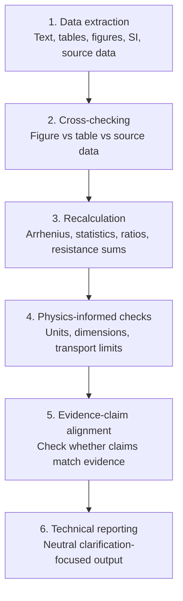

# Academic Paper Data Consistency Audit

> **A physics-informed toolkit for checking whether published materials electrochemistry papers are internally consistent.**


This project provides a structured workflow for identifying technical points that may require clarification in published or pre-submission scientific papers. It is designed especially for materials electrochemistry, solid oxide cells, protonic ceramic cells, ionic transport studies, and related fields.

It helps check:

- **Figure / table / source-data mismatches**
- **Batch reported-value/source-data tolerance reports**
- **Arrhenius fitting and statistical recalculation**
- **Rp / ASR component-sum consistency**
- **Faradaic efficiency and gas-production consistency**
- **Conductivity geometry normalization**
- **Dimensional and physical-consistency issues**
- **Evidence-claim overextension**
- **PubPeer-style post-publication technical comments**

The goal is not to accuse authors. The goal is to make technical questions specific, reproducible, and neutrally worded.

---

## Documentation

A lightweight documentation site is available under `docs/` and can be published through GitHub Pages.

Start with:

- `docs/index.md` — project overview
- `docs/getting_started.md` — installation and first commands
- `docs/workflows.md` — audit workflows
- `docs/case_studies.md` — synthetic examples
- `docs/responsible_use.md` — responsible-use guidance
- `docs/roadmap.md` — planned development directions
- `docs/release_checklist.md` — release preparation checklist
- `examples/cli_output/` — representative CLI output examples

---

## Motivation

Many post-publication discussions do not start from a single obvious error. They often start from small inconsistencies between the main text, figures, tables, Supplementary Information, and source data.

In materials electrochemistry, these issues can become important because many conclusions depend on derived quantities such as activation energies, polarization resistances, diffusion coefficients, current-density-normalized performance metrics, gas-production rates, Faradaic efficiencies, geometry-normalized conductivity values, and transport-model parameters. A small mismatch in one table can propagate into a different mechanistic interpretation.

This repository provides a practical audit workflow for checking those links before drawing conclusions, writing a technical comment, or designing follow-up experiments.

---

## Project Scope

This toolkit focuses on technical consistency checks for papers involving:

- electrode kinetics and polarization resistance (`Rp`, `ASR`)
- Arrhenius fitting of conductivity, resistance, or transport data
- conductivity conversion from resistance, thickness, and area
- resistance-component sums from EIS/DRT/deconvolution tables
- current-voltage-power relationships in fuel cells and electrolyzers
- gas-production and Faradaic-efficiency relationships
- source-data/table tolerance reporting
- diffusion coefficients and transport-model parameters
- figure/table/SI/source-data consistency
- evidence-claim alignment in mechanistic interpretation

It is most directly aimed at materials electrochemistry, but the structure can be adapted to other experimental fields.

---

## What This Project Does Not Do

This project does **not** make ethical judgments. It does **not** infer author intent. It does **not** replace expert peer review. It provides a structured technical workflow for identifying points that may require clarification, correction, or independent reproduction.

---

## Workflow



---

## Quick Start

```bash
git clone https://github.com/YinBryn/academic-paper-data-consistency-audit.git
cd academic-paper-data-consistency-audit

python -m venv .venv
source .venv/bin/activate  # Windows: .venv\Scripts\activate

pip install -r requirements.txt
pip install -e .

paper-audit --help
paper-audit demo
pytest
```

Use `paper-audit demo` as the fastest smoke test after installation. It runs representative synthetic checks and prints a compact pass-style report.

You can use either the installable CLI (`paper-audit`) or the standalone scripts under `scripts/`.

### Example: one-command demo

```bash
paper-audit demo
```

Representative output:

```text
Academic Paper Data Consistency Audit Demo
===========================================
Synthetic data only. No real article data is used.

[PASS] Arrhenius recalculation - Ea=...
[PASS] Statistics recalculation - n=5, mean=...
[PASS] I-V-P dimensional check - calculated_power_density=...
[PASS] Resistance component-sum check - component_sum=...
[PASS] Faradaic efficiency check - calculated_FE=...
[PASS] Conductivity geometry check - calculated_sigma=...
[PASS] Batch tolerance report - rows=2, pass=2, fail=0

Demo completed: 7 synthetic checks passed.
```

### Example: Arrhenius fitting

```bash
paper-audit arrhenius \
  --temperature-c 800 750 700 \
  --resistance 0.022 0.053 0.103
```

Representative output is available in `examples/cli_output/arrhenius_output.txt`.

Equivalent standalone script:

```bash
python scripts/arrhenius_fit.py \
  --temperature-c 800 750 700 \
  --resistance 0.022 0.053 0.103
```

### Example: statistics check

```bash
paper-audit statistics \
  --values 4.65 4.83 4.84 4.76 4.77 \
  --reported-mean 4.79 \
  --reported-std 0.04
```

### Example: performance ratio

```bash
paper-audit ratio --new 3.53 --baseline 2.74
```

### Example: dimensional check

```bash
paper-audit dimensional --power-density 2.6 --current-density 2.0 --voltage 1.3
```

### Example: tolerance report

```bash
paper-audit tolerance-report \
  --csv case_studies/tolerance_report/input.csv \
  --reported-column reported_Rp_ohm_cm2 \
  --reference-column source_Rp_ohm_cm2 \
  --id-column sample \
  --tolerance-pct 5.0
```

This compares reported values against source-data/reference values across multiple rows.

### Example: resistance component-sum check

```bash
paper-audit resistance-sum \
  --reported-total 0.180 \
  --components 0.052 0.061 0.038 \
  --tolerance-pct 1.0
```

This checks whether a reported total Rp/ASR equals the sum of listed components.

### Example: Faradaic efficiency check

```bash
paper-audit faradaic-efficiency \
  --current-density-a-cm2 0.5 \
  --area-cm2 1.0 \
  --measured-flow-ml-min 3.30 \
  --electrons-per-molecule 2 \
  --reported-fe-pct 95.0
```

This calculates gas-flow-based Faradaic efficiency from current and electron stoichiometry.

### Example: conductivity geometry check

```bash
paper-audit conductivity-geometry \
  --resistance-ohm 10.0 \
  --thickness-mm 0.33 \
  --diameter-mm 6.0 \
  --reported-conductivity-s-cm 0.01167
```

This recalculates conductivity from resistance, sample thickness, and electrode/sample area using `sigma = L / (R × A)`.

---

## Synthetic Case Studies

The `case_studies/` directory contains fully synthetic examples. They are not based on any real paper, author, DOI, or publisher-provided data set.

| Case | Focus | Example output |
|---|---|---|
| `arrhenius_discrepancy/` | Activation-energy recalculation | Neutral clarification request for an Ea mismatch |
| `ivp_consistency/` | `P = jV` consistency | Direct check of current-density, voltage, and power-density values |
| `tolerance_report/` | Batch source-data/table comparison | Row-level pass/fail tolerance report |
| `resistance_component_sum/` | Rp/ASR component-sum consistency | Direct check of total resistance against listed components |
| `faradaic_efficiency/` | FE and product-flow consistency | Recalculated FE from current and measured flow |
| `conductivity_geometry/` | Conductivity geometry normalization | Recalculated conductivity from resistance, thickness, and area |
| `rp_table_figure_mismatch/` | Figure/table/source-data consistency | Single-issue comment for an Rp mismatch |
| `evidence_claim_overreach/` | Evidence-claim alignment | Mechanistic claim narrowed to what the evidence supports |

Each case includes a small input file or evidence table, a reproducible check or reasoning workflow, a technical issue summary, and a neutral comment draft.

---

## Evidence Levels

| Level | Meaning |
|---|---|
| L1 | Direct numerical inconsistency |
| L2 | Recalculation discrepancy |
| L3 | Dimensional or physical-unit issue |
| L4 | Evidence-claim overextension |
| L5 | Hypothesis or concern requiring additional data |

These levels are not severity judgments. They describe the type of evidence available for a technical concern.

---

## PubPeer-style Issue Reporting

The repository includes a single-issue comment template in `templates/pubpeer_style_issue_format.md`. The style is:

1. identify the exact location
2. state the observation
3. show the check or recalculation
4. explain why it matters
5. request clarification without inferring intent

This keeps comments concise, reproducible, and constructive.

---

## Responsible Use

- Keep all comments technical and evidence-based.
- Distinguish observation, recalculation, and interpretation.
- Do not infer author intent.
- Do not redistribute copyrighted PDFs or proprietary datasets.
- Give authors and journals room to clarify.
- Use source data links rather than re-uploading publisher files whenever possible.

---

## License

This project is released under the MIT License.
