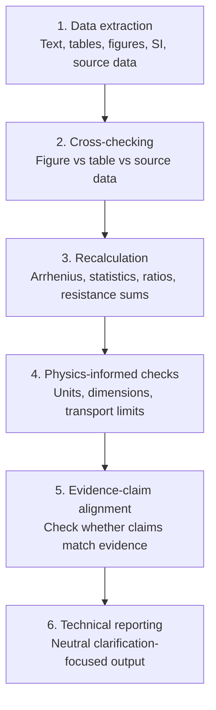

# Academic Paper Data Consistency Audit

> **A physics-informed toolkit for checking whether published materials electrochemistry papers are internally consistent.**


This project provides a structured workflow for identifying technical points that may require clarification in published or pre-submission scientific papers. It is designed especially for materials electrochemistry, solid oxide cells, protonic ceramic cells, ionic transport studies, and related fields.

It helps check:

- **Figure / table / source-data mismatches**
- **Arrhenius fitting and statistical recalculation**
- **Dimensional and physical-consistency issues**
- **Evidence-claim overextension**
- **PubPeer-style post-publication technical comments**

The goal is not to accuse authors. The goal is to make technical questions specific, reproducible, and neutrally worded.

---

## Motivation

Many post-publication discussions do not start from a single obvious error. They often start from small inconsistencies between the main text, figures, tables, Supplementary Information, and source data.

In materials electrochemistry, these issues can become important because many conclusions depend on derived quantities such as activation energies, polarization resistances, diffusion coefficients, current-density-normalized performance metrics, and transport-model parameters. A small mismatch in one table can propagate into a different mechanistic interpretation.

This repository provides a practical audit workflow for checking those links before drawing conclusions, writing a technical comment, or designing follow-up experiments.

---

## Project Scope

This toolkit focuses on technical consistency checks for papers involving:

- electrode kinetics and polarization resistance (`Rp`, `ASR`)
- Arrhenius fitting of conductivity, resistance, or transport data
- current-voltage-power relationships in fuel cells and electrolyzers
- diffusion coefficients and transport-model parameters
- figure/table/SI/source-data consistency
- evidence-claim alignment in mechanistic interpretation

It is most directly aimed at materials electrochemistry, but the structure can be adapted to other experimental fields.

---

## What This Project Does Not Do

This project does **not** make ethical judgments. It does **not** infer author intent. It does **not** replace expert peer review. It provides a structured technical workflow for identifying points that may require clarification, correction, or independent reproduction.

---

## Workflow



---

## Quick Start

```bash
git clone https://github.com/YinBryn/academic-paper-data-consistency-audit.git
cd academic-paper-data-consistency-audit

python -m venv .venv
source .venv/bin/activate  # Windows: .venv\Scripts\activate

pip install -r requirements.txt

python scripts/arrhenius_fit.py --help
python scripts/statistics_check.py --help
python scripts/performance_ratio_check.py --help
python scripts/dimensional_check.py --help

pytest
```

### Example: Arrhenius fitting

```bash
python scripts/arrhenius_fit.py \
  --temperature-c 800 750 700 \
  --resistance 0.022 0.053 0.103
```

### Example: statistics check

```bash
python scripts/statistics_check.py \
  --values 4.65 4.83 4.84 4.76 4.77 \
  --reported-mean 4.79 \
  --reported-std 0.04
```

### Example: performance ratio

```bash
python scripts/performance_ratio_check.py --new 3.53 --baseline 2.74
```

### Example: dimensional check

```bash
python scripts/dimensional_check.py --power-density 2.6 --current-density 2.0 --voltage 1.3
```

---

## Evidence Levels

| Level | Meaning |
|---|---|
| L1 | Direct numerical inconsistency |
| L2 | Recalculation discrepancy |
| L3 | Dimensional or physical-unit issue |
| L4 | Evidence-claim overextension |
| L5 | Hypothesis or concern requiring additional data |

These levels are not severity judgments. They describe the type of evidence available for a technical concern.

---

## PubPeer-style Issue Reporting

The repository includes a single-issue comment template in `templates/pubpeer_style_issue_format.md`. The style is:

1. identify the exact location
2. state the observation
3. show the check or recalculation
4. explain why it matters
5. request clarification without inferring intent

This keeps comments concise, reproducible, and constructive.

---

## Responsible Use

- Keep all comments technical and evidence-based.
- Distinguish observation, recalculation, and interpretation.
- Do not infer author intent.
- Do not redistribute copyrighted PDFs or proprietary datasets.
- Give authors and journals room to clarify.
- Use source data links rather than re-uploading publisher files whenever possible.

---

## License

This project is released under the MIT License.
