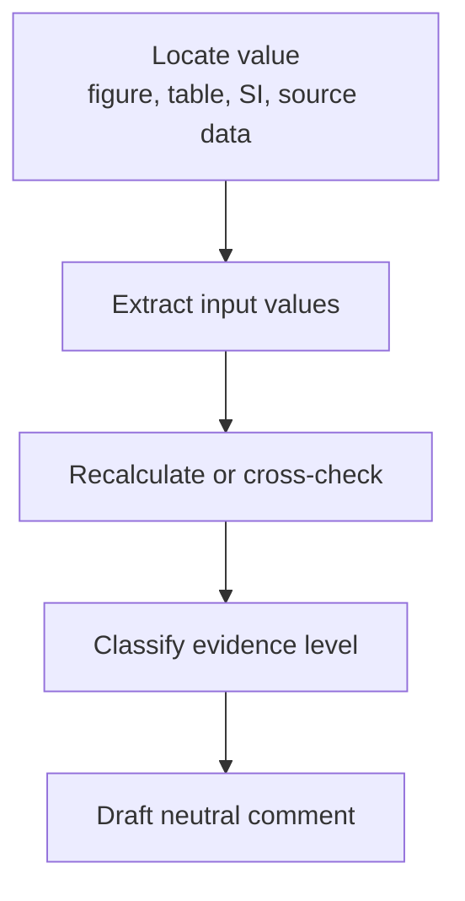

# Audit Workflows

The project follows a narrow, reproducible, single-issue workflow.



## 1. Arrhenius recalculation

Use when a paper reports activation energy from conductivity, resistance, ASR, or Rp data.

```bash
paper-audit arrhenius \
  --temperature-c 800 750 700 \
  --resistance 0.022 0.053 0.103
```

Report:

- input temperatures
- input resistance or ASR values
- fitting convention, for example `ln(R)` vs `1000/T`
- recalculated activation energy
- difference from the reported value

## 2. Statistics recalculation

Use when a reported mean or standard deviation can be checked from replicate values.

```bash
paper-audit statistics \
  --values 4.65 4.83 4.84 4.76 4.77 \
  --reported-mean 4.79 \
  --reported-std 0.04
```

Report whether the recalculated value is within the declared tolerance.

## 3. I–V–P consistency

Use for electrochemical cell performance values.

```bash
paper-audit dimensional \
  --power-density 2.6 \
  --current-density 2.0 \
  --voltage 1.3
```

The direct relation is:

```text
P = j × V
```

## 4. Batch tolerance report

Use when a table contains multiple reported values that can be compared against source-data or reference values row by row.

```bash
paper-audit tolerance-report \
  --csv case_studies/tolerance_report/input.csv \
  --reported-column reported_Rp_ohm_cm2 \
  --reference-column source_Rp_ohm_cm2 \
  --id-column sample \
  --tolerance-pct 5.0
```

Report:

- total number of rows
- number of values within tolerance
- number of values outside tolerance
- row-level reported/reference values
- absolute and relative differences

## 5. Resistance component-sum consistency

Use when a paper reports a total Rp/ASR value and also lists component contributions, for example EIS arcs, DRT processes, or fitted equivalent-circuit elements.

```bash
paper-audit resistance-sum \
  --reported-total 0.180 \
  --components 0.052 0.061 0.038 \
  --tolerance-pct 1.0
```

Report:

- reported total Rp/ASR
- listed component values
- sum of components
- absolute difference
- relative difference in percent
- whether the difference is within tolerance

## 6. Faradaic efficiency and gas-production consistency

Use when a paper reports current, product-gas flow, and Faradaic efficiency.

```bash
paper-audit faradaic-efficiency \
  --current-density-a-cm2 0.5 \
  --area-cm2 1.0 \
  --measured-flow-ml-min 3.30 \
  --electrons-per-molecule 2 \
  --reported-fe-pct 95.0
```

For a product gas, the 100% FE gas-flow estimate is based on:

```text
molar flow = current / (electrons per molecule × F)
```

Report:

- total current
- electron stoichiometry
- measured gas flow
- theoretical gas flow at 100% FE
- calculated FE
- difference from reported FE, if provided

## 7. Conductivity geometry normalization

Use when a paper reports conductivity calculated from resistance, sample thickness, and area.

```bash
paper-audit conductivity-geometry \
  --resistance-ohm 10.0 \
  --thickness-mm 0.33 \
  --diameter-mm 6.0 \
  --reported-conductivity-s-cm 0.01167
```

The check uses:

```text
sigma = L / (R × A)
```

Report:

- resistance in ohm
- thickness in cm
- area in cm²
- calculated conductivity in S/cm
- relative difference from the reported conductivity, if provided

## 8. Figure/table/source-data consistency

Use when the same parameter appears in multiple locations.

Recommended table:

| Location | Value | Notes |
|---|---:|---|
| Figure |  | extracted from plot |
| Table |  | reported value |
| Source data |  | original data file |

## 9. Evidence-claim alignment

Use when a paper makes a mechanistic claim that may require additional evidence.

Separate:

- what the data directly show
- what the authors infer
- what additional evidence would be needed to isolate the proposed mechanism
