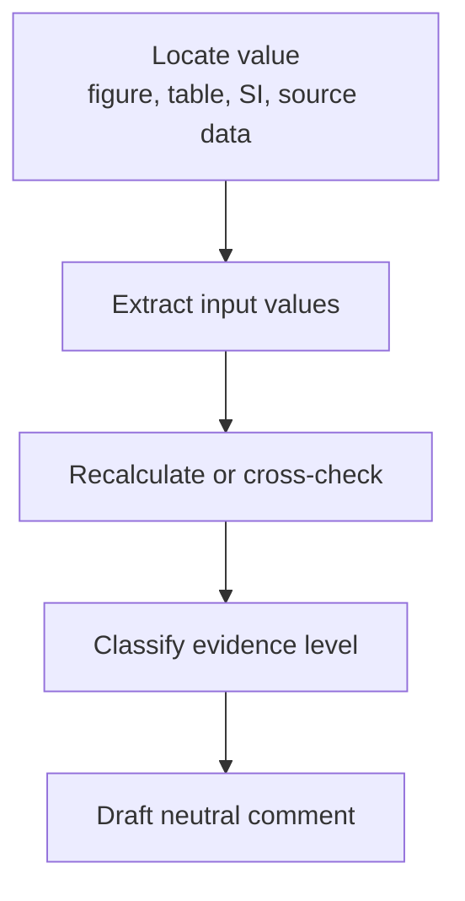

# Audit Workflows

The project follows a narrow, reproducible, single-issue workflow.



## 1. Arrhenius recalculation

Use when a paper reports activation energy from conductivity, resistance, ASR, or Rp data.

```bash
paper-audit arrhenius \
  --temperature-c 800 750 700 \
  --resistance 0.022 0.053 0.103
```

Report:

- input temperatures
- input resistance or ASR values
- fitting convention, for example `ln(R)` vs `1000/T`
- recalculated activation energy
- difference from the reported value

## 2. Statistics recalculation

Use when a reported mean or standard deviation can be checked from replicate values.

```bash
paper-audit statistics \
  --values 4.65 4.83 4.84 4.76 4.77 \
  --reported-mean 4.79 \
  --reported-std 0.04
```

Report whether the recalculated value is within the declared tolerance.

## 3. I–V–P consistency

Use for electrochemical cell performance values.

```bash
paper-audit dimensional \
  --power-density 2.6 \
  --current-density 2.0 \
  --voltage 1.3
```

The direct relation is:

```text
P = j × V
```

## 4. Figure/table/source-data consistency

Use when the same parameter appears in multiple locations.

Recommended table:

| Location | Value | Notes |
|---|---:|---|
| Figure |  | extracted from plot |
| Table |  | reported value |
| Source data |  | original data file |

## 5. Evidence-claim alignment

Use when a paper makes a mechanistic claim that may require additional evidence.

Separate:

- what the data directly show
- what the authors infer
- what additional evidence would be needed to isolate the proposed mechanism
